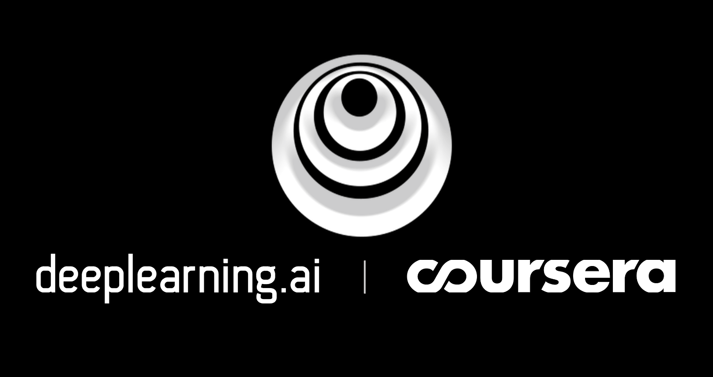

## [Deep Learning Specialization](https://www.coursera.org/specializations/deep-learning)

Deep Learning by deeplearning.ai on Coursera
 
This repository contains all my projects which I have done during this specialization. I would like to thank Prof. Andrew Ng and his team to create such a wonderful content. Kindly use it for reference and learning purposes to break into AI.

My specialization [certificate](/blob/master/Coursera_UYMVRX5M3P4R.pdf).

## About The Specialization
If you want to break into AI, this Specialization will help you do so. Deep Learning is one of the most highly sought after skills in tech. We will help you become good at Deep Learning.

In five courses, you will learn the foundations of Deep Learning, understand how to build neural networks, and learn how to lead successful machine learning projects. You will learn about Convolutional networks, RNNs, LSTM, Adam, Dropout, BatchNorm, Xavier/He initialization, and more. You will work on case studies from healthcare, autonomous driving, sign language reading, music generation, and natural language processing. You will master not only the theory, but also see how it is applied in industry. You will practice all these ideas in Python and in TensorFlow, which we will teach.

You will also hear from many top leaders in Deep Learning, who will share with you their personal stories and give you career advice.

### Instructor: [Prof. Andrew Ng](https://www.coursera.org/instructor/andrewng)

## Course Projects
* **Course 1: Neural Networks and Deep Learning**

  Objectives:

  * Studied the major technology trends driving Deep Learning and the key parameters in a neural network’s architecture
  * Built, trained and applied fully connected deep neural networks using Python3, NumPy, SciPy etc
  * Improved the efficiency of neural networks by vectorization

* **Course 2 - Structuring Machine Learning Projects**

  Objectives:

  * Understand how to diagnose errors in a machine learning system, and 
  * Be able to prioritize the most promising directions for reducing error
  * Understand complex ML settings, such as mismatched training/test sets, and comparing to and/or surpassing human-level performance
  * Know how to apply end-to-end learning, transfer learning, and multi-task learning

* **Course 3 - Improving Deep Neural Networks: Hyperparameter tuning, Regularization and Optimization**

  Objectives:

  * Studied and effectively used the common neural network “tricks and techniques”, including parameter initialization, L2 and dropout regularization, Batch normalization, gradient checking.
  * Implemented and applied a variety of optimization algorithms, such as mini-batch gradient, Momentum, RMSprop and Adam to check for their convergence.
  * Understood the new best-practices for the DL era to set up train/dev/test sets and analyze bias and variance. 
  * Implemented a neural network using TensorFlow.

* **Course 4 - Convolutional Neural Networks**

  Objectives:

  * Understand how to build a convolutional neural network, including recent variations such as residual networks.
  * Know how to apply convolutional networks to visual detection and recognition tasks.
  * Know to use neural style transfer to generate art.
  * Be able to apply these algorithms to a variety of image, video, and other 2D or 3D data.
  
* **Course 5 - Sequence Models**

  Objectives:
  
   * Understand how to build and train Recurrent Neural Networks (RNNs), and commonly-used variants such as GRUs and LSTMs.
   * Be able to apply sequence models to natural language problems, including text synthesis. 
   * Be able to apply sequence models to audio applications, including speech recognition and music synthesis.
  
## TensorFlow Projects
* Hands on sessions on TensorFlow Keras tutorials, optimizing these tutorials by implementing the knowledge from Coursera deep learning courses. 
* Optimized the overfitting problem of basic classification tutorial on Fashion-MNIST data set by implementing L2 regularization technique.
